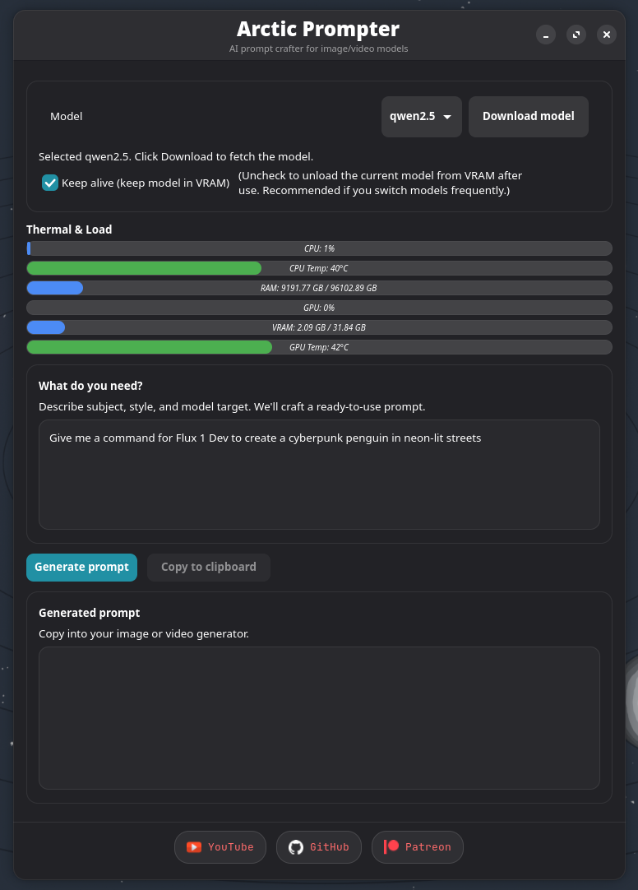

<p align="center">
  
</p>

# 🧊 Arctic Prompter
[](#-%F0%9F%9B%A0-requirements)
[](#-need-help)

A local-first **prompt crafting studio** for AI image and video generation. It runs on your Ollama backend and ships quantized Qwen2.5 and Llama 3.2 text models for fast, hardware-friendly prompt ideation. You can also feed in an image and let Qwen2.5-VL draft prompts.

---

## 📚 Overview

Arctic Prompter keeps everything on-device: Ollama handles the inference, quantized models keep usage light, and the UI guides you from idea to ready-to-run prompts for images or videos. Swap between Qwen2.5 and Llama 3.2 for different writing styles, or use Qwen2.5-VL to turn reference images into structured prompts.

---

## 🧩 Core Features

- 🧠 **Ollama-powered prompting** using quantized Qwen2.5 and Llama 3.2 for responsive, on-device text generation.
- 🖼️ **Image-to-prompt with Qwen2.5-VL** to convert reference images into ready-to-tweak prompts.
- 🎬 **Image + video prompt flows** with guidance to keep outputs consistent across modalities.
- 🌡️ **Thermal monitor** that surfaces CPU/GPU temps so you know when to pause or switch models.
- 🕒 **Keep-alive toggle** to hold a model in memory for long sessions; turn it off if you’re switching models frequently.
- ⚡ **Hardware-friendly defaults**—all bundled models are quantized to run smoothly on most machines.

---

## 🚀 Getting Started

1. **Download the latest `.flatpak`** from this repo’s Releases page.
2. Install it:
   ```bash
   sudo flatpak install ArcticPrompter.flatpak
   ```

---

## 🛠 Requirements

- Active internet connection (for pulling LLM models and downloading the Ollama backend).
- Flatpak runtime on your system:

  ```bash
  # Ubuntu / Debian / Linux Mint
  sudo apt install flatpak

  # Fedora (already included on Workstation editions)
  sudo dnf install flatpak

  # Arch / Manjaro
  sudo pacman -S flatpak
  ```

- If you previously ran <https://github.com/ArcticLatent/post-linux>, you already have the required runtimes and codecs.

---

## 📁 Download Locations

- When you first launch the app, the Ollama binary automatically downloads and installs to `~/.local/share/arcticprompter/ollama`.
- LLM models download into `~/.local/share/arcticprompter/ollama/models/blobs`.

---

## 💡 Usage Tips

- Start with Qwen2.5 for concise prompts; switch to Llama 3.2 when you want more verbose phrasing.
- Use Qwen2.5-VL when you have a reference image—drag and drop the image into the app or upload an image by clicking import image.

---

## 🆘 Need Help?

Open an issue in this repository if you hit a bug, need troubleshooting, or want to request new prompt workflows or model presets.

Enjoy smoother prompt crafting!

---

## 🖼️ Demo Preview



---

## 🧊 Author

Burce Boran 🎥 Asset Supervisor / VFX Artist | 🐧 Arctic Latent

[](https://youtube.com/@ArcticLatent)
[](https://patreon.com/ArcticLatent)
[](https://huggingface.co/arcticlatent)

---

Copyright (c) 2025 Arctic Prompter. All Rights Reserved.

This software is proprietary and closed-source.

You may download and use the compiled Flatpak package for personal use only. Redistribution, modification, reverse engineering, or commercial use of this software or any included assets is prohibited without written permission from the copyright holder.

The software is provided “as is” without warranty of any kind.
